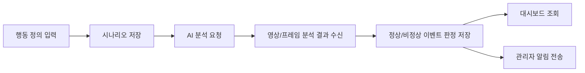
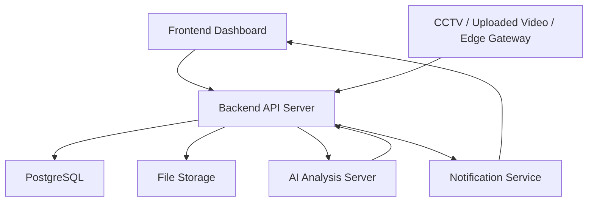

# Backend

## 담당

백엔드 담당자가 작업하는 공간입니다.

APAP(Abnormal Pattern Alarmer Platform)의 API 서버, 데이터베이스, 인증/권한, 알림 이벤트 저장 및 조회, AI 분석 서버 연동 로직을 구현합니다.

## 목적

사용자가 정의한 비정상 행동 시나리오와 CCTV/영상 분석 결과를 안정적으로 저장하고, AI 서버의 판단 결과를 대시보드와 알림 시스템으로 전달하는 백엔드 기반을 구축합니다.

APAP의 핵심 흐름은 다음과 같습니다.



## 프로젝트 요약

APAP는 CCTV 또는 업로드 영상에서 사람의 행동, 표정, 객체 간 거리와 접촉 여부를 분석하여 정상/비정상 행동을 판단하는 AI 기반 비정상 행동 알람 플랫폼입니다.

기존 CCTV가 단순 기록이나 사후 확인에 머무르는 문제를 해결하기 위해, 사용자가 직접 감지할 행동을 정의하고 AI 분석 결과를 바탕으로 관리자에게 실시간 알림을 제공합니다.

## 백엔드 책임 범위

- 사용자, 관리자 계정 관리
- 로그인, 인증, 권한 처리
- 감지 시나리오 등록/수정/조회/삭제
- 영상 파일 또는 스트림 메타데이터 관리
- AI 서버 분석 요청 및 결과 수신
- 이상 행동 이벤트 로그 저장
- 대시보드용 통계/이벤트 조회 API 제공
- 알림 발송 이력 저장
- 파일 업로드, 분석 상태, 에러 상태 관리
- 추후 Edge Gateway, CCTV, 외부 카메라 연동 대비

## 권장 기술스택

현재 팀 구성과 MVP 속도를 고려하면 Python 기반 AI 서버와 연동이 쉬운 구조가 유리합니다.

| 영역 | 권장안 | 이유 |
|---|---|---|
| API 서버 | FastAPI 또는 Spring Boot | FastAPI는 AI/Python 연동이 빠르고, Spring Boot는 안정적인 백엔드 구조에 유리 |
| DB | PostgreSQL | 이벤트 로그, 시나리오, 사용자 데이터를 안정적으로 관리 |
| ORM | SQLAlchemy / JPA | 선택한 API 서버에 맞춰 사용 |
| 인증 | JWT 기반 인증 | 프론트엔드와 모바일/대시보드 연동에 단순하고 적합 |
| 파일 저장 | Local Storage -> S3 확장 | MVP는 로컬, 이후 AWS S3 전환 |
| 비동기 작업 | Celery/RQ 또는 Spring Scheduler | AI 분석 요청, 알림 발송, 긴 작업 분리 |
| 알림 | Email/SMS/Web Push 확장 | MVP는 DB 저장 + 화면 알림부터 구현 |
| 배포 | Docker, AWS EC2 | 계획서의 AWS, Docker, DevOps 방향과 일치 |

팀원이 Spring 경험이 조금 있고 AI 서버는 Python 기반일 가능성이 높으므로, 백엔드는 둘 중 하나로 명확히 정하면 됩니다.

- 빠른 MVP 우선: `FastAPI + PostgreSQL`
- 백엔드 포트폴리오/운영 구조 우선: `Spring Boot + PostgreSQL`

## 시스템 구조



## 핵심 도메인

### User

서비스 사용자 또는 관리자 계정입니다.

- id
- email
- password_hash
- name
- role: `ADMIN`, `MANAGER`, `VIEWER`
- created_at
- updated_at

### Scenario

사용자가 정의한 감지 조건입니다.

- id
- user_id
- name
- description
- target_location
- behavior_text
- conditions_json
- threshold
- is_active
- created_at
- updated_at

예시:

```json
{
  "name": "무인매장 절도 의심",
  "behavior_text": "물건을 가방에 넣고 결제 없이 출구로 이동",
  "conditions": {
    "hand_bag_distance": "< 20cm",
    "payment_detected": false,
    "exit_direction": true
  },
  "threshold": 0.8
}
```

### VideoSource

CCTV, 업로드 영상, Edge Gateway 등 영상 입력 소스입니다.

- id
- user_id
- type: `UPLOAD`, `CCTV`, `EDGE_GATEWAY`
- name
- source_url
- status: `READY`, `ANALYZING`, `ERROR`, `DISABLED`
- created_at
- updated_at

### AnalysisJob

AI 서버에 요청한 분석 작업 단위입니다.

- id
- scenario_id
- video_source_id
- status: `PENDING`, `RUNNING`, `DONE`, `FAILED`
- requested_at
- completed_at
- error_message

### DetectionEvent

AI 분석 결과로 생성된 정상/비정상 판단 이벤트입니다.

- id
- analysis_job_id
- scenario_id
- video_source_id
- event_type: `NORMAL`, `ABNORMAL`, `UNKNOWN`
- severity: `LOW`, `MEDIUM`, `HIGH`, `CRITICAL`
- confidence_score
- detected_at
- snapshot_url
- clip_url
- result_json
- created_at

### Alert

관리자에게 전달되는 알림 기록입니다.

- id
- detection_event_id
- receiver_id
- channel: `DASHBOARD`, `EMAIL`, `SMS`, `WEB_PUSH`
- status: `PENDING`, `SENT`, `FAILED`, `READ`
- message
- sent_at
- read_at

## API 초안

### Auth

| Method | Endpoint | 설명 |
|---|---|---|
| POST | `/api/auth/signup` | 회원가입 |
| POST | `/api/auth/login` | 로그인 |
| POST | `/api/auth/logout` | 로그아웃 |
| GET | `/api/auth/me` | 현재 사용자 정보 |

### Scenario

| Method | Endpoint | 설명 |
|---|---|---|
| POST | `/api/scenarios` | 감지 시나리오 생성 |
| GET | `/api/scenarios` | 시나리오 목록 조회 |
| GET | `/api/scenarios/{scenarioId}` | 시나리오 상세 조회 |
| PATCH | `/api/scenarios/{scenarioId}` | 시나리오 수정 |
| DELETE | `/api/scenarios/{scenarioId}` | 시나리오 삭제 |

### Video

| Method | Endpoint | 설명 |
|---|---|---|
| POST | `/api/videos/upload` | 영상 파일 업로드 |
| GET | `/api/videos` | 영상 소스 목록 조회 |
| GET | `/api/videos/{videoId}` | 영상 소스 상세 조회 |
| PATCH | `/api/videos/{videoId}` | 영상 소스 수정 |

### Analysis

| Method | Endpoint | 설명 |
|---|---|---|
| POST | `/api/analysis/jobs` | AI 분석 작업 요청 |
| GET | `/api/analysis/jobs` | 분석 작업 목록 조회 |
| GET | `/api/analysis/jobs/{jobId}` | 분석 작업 상태 조회 |
| POST | `/api/analysis/callback` | AI 서버 분석 결과 수신 |

### Event & Dashboard

| Method | Endpoint | 설명 |
|---|---|---|
| GET | `/api/events` | 감지 이벤트 목록 조회 |
| GET | `/api/events/{eventId}` | 감지 이벤트 상세 조회 |
| GET | `/api/dashboard/summary` | 대시보드 요약 통계 |
| GET | `/api/dashboard/timeline` | 시간대별 이벤트 조회 |
| GET | `/api/dashboard/severity` | 심각도별 통계 조회 |

### Alert

| Method | Endpoint | 설명 |
|---|---|---|
| GET | `/api/alerts` | 알림 목록 조회 |
| PATCH | `/api/alerts/{alertId}/read` | 알림 읽음 처리 |
| POST | `/api/alerts/test` | 테스트 알림 발송 |

## AI 서버 연동 규칙

백엔드는 AI 모델을 직접 실행하지 않고, 분석 요청과 결과 저장을 담당합니다.

### 분석 요청 예시

```json
{
  "job_id": 1,
  "scenario": {
    "id": 10,
    "name": "ATM 이상행동 감지",
    "behavior_text": "ATM 앞에서 불안한 표정으로 주변을 반복적으로 확인"
  },
  "video": {
    "id": 7,
    "source_url": "https://storage.example.com/videos/atm-001.mp4"
  },
  "callback_url": "https://api.example.com/api/analysis/callback"
}
```

### 분석 결과 수신 예시

```json
{
  "job_id": 1,
  "status": "DONE",
  "events": [
    {
      "event_type": "ABNORMAL",
      "severity": "HIGH",
      "confidence_score": 0.91,
      "detected_at": "2026-07-01T12:10:00",
      "snapshot_url": "https://storage.example.com/snapshots/event-1.jpg",
      "result": {
        "pose_score": 0.82,
        "face_anxiety_score": 0.76,
        "object_relation": "hand-near-bag",
        "reason": "주변 탐색과 객체 접근 행동이 동시에 감지됨"
      }
    }
  ]
}
```

## MVP 구현 우선순위

1. 프로젝트 기본 서버 세팅
2. 사용자 인증
3. 시나리오 CRUD
4. 영상 업로드 및 메타데이터 저장
5. AI 분석 작업 요청/상태 관리
6. AI 결과 callback 수신
7. DetectionEvent 저장
8. 대시보드용 이벤트/통계 API
9. 알림 DB 저장 및 읽음 처리
10. Docker 기반 실행 환경 정리

## 개발 규칙

- API 응답 형식은 통일합니다.
- 모든 주요 데이터에는 `created_at`, `updated_at`을 둡니다.
- 삭제는 가능하면 soft delete를 우선 고려합니다.
- AI 서버 호출 실패 시 재시도하거나 `FAILED` 상태와 에러 메시지를 저장합니다.
- 영상 파일 원본, 스냅샷, 분석 결과 JSON은 분리해서 저장합니다.
- 개인정보와 영상 데이터는 실제 배포 단계에서 접근 권한과 보관 기간을 반드시 관리합니다.

공통 응답 예시:

```json
{
  "success": true,
  "data": {},
  "message": "요청이 성공했습니다."
}
```

에러 응답 예시:

```json
{
  "success": false,
  "error": {
    "code": "SCENARIO_NOT_FOUND",
    "message": "시나리오를 찾을 수 없습니다."
  }
}
```

## 테스트 기준

- 인증 API 정상/실패 케이스
- 시나리오 CRUD 테스트
- 영상 업로드 테스트
- AI callback 수신 테스트
- 이벤트 저장 테스트
- 대시보드 통계 API 테스트
- 권한 없는 사용자의 접근 차단 테스트

## 7월 MVP 목표

계획서 기준 MVP는 7월 중순까지 다음 수준을 목표로 합니다.

- 파일 업로드 가능
- 업로드 영상에 대한 분석 요청 가능
- AI 서버가 반환한 정상/비정상 결과 저장 가능
- 대시보드에서 감지 이벤트와 로그 확인 가능
- 이상 이벤트 발생 시 알림 목록에 기록 가능

## 추후 작성할 내용

- 백엔드 기술스택 최종 결정
- 로컬 실행 방법
- 데이터베이스 연결 방법
- API 구현 규칙
- 테스트 실행 방법
- 배포 방법
- Git 브랜치 전략
- AI 서버와의 최종 요청/응답 스펙
